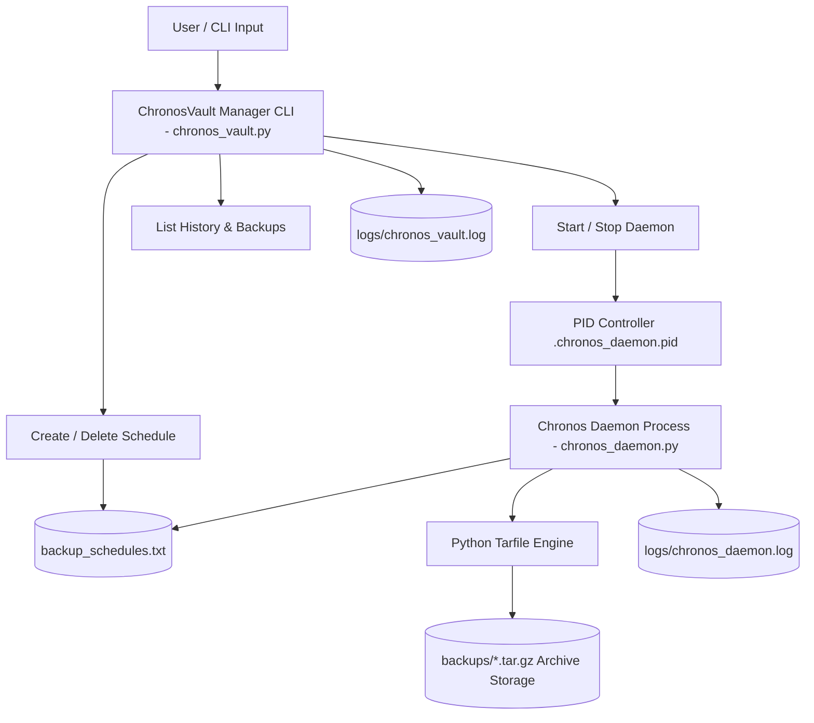

# ⏱️ ChronosVault

[](https://www.python.org/)
[](LICENSE.md)
[](#-system-architecture)

**ChronosVault** is an automated background backup daemon and schedule orchestration manager written in Python. It enables users to schedule, monitor, and compress targeted directories and files into timestamped `.tar.gz` archives with process lifecycle controls and execution tracking.

---

## 💻 Terminal & CLI Preview

Here is an example of running CLI routines and inspecting background daemon logs in **ChronosVault**:

```text
# 1. Create a timed backup schedule for a project directory
$ python3 chronos_vault.py create "/Users/sayed/documents;14:30;docs_backup"
[13/09/2026 03:00] New schedule added: /Users/sayed/documents;14:30;docs_backup

# 2. List all active queued schedules
$ python3 chronos_vault.py list
0: /Users/sayed/documents;14:30;docs_backup
[13/09/2026 03:01] Show schedules list

# 3. Start the background archiving daemon
$ python3 chronos_vault.py start
[13/09/2026 03:02] chronos_daemon started

# 4. View completed archives in storage
$ python3 chronos_vault.py backups
docs_backup.tar
[13/09/2026 03:05] Show backups list

# 5. Inspect daemon trace logs
$ cat logs/chronos_daemon.log
[13/09/2026 14:30] Backup done for /Users/sayed/documents in backups/docs_backup.tar
```

---

## ⚡ Key Highlights

- **Daemon Background Monitor**: Asynchronous daemon process (`chronos_daemon.py`) that monitors backup schedule queues and executes tasks at target times.
- **Automated Archiving Engine**: Automatically packages target folders into compressed `.tar.gz` archives.
- **CLI Management Suite**: Interface (`chronos_vault.py`) for creating, listing, deleting schedules, and controlling daemon state (`start`/`stop`).
- **Process Lifecycle Safety**: PID-file tracking (`.chronos_daemon.pid`) prevents duplicate daemon instances and enables clean process signaling.
- **Persistent Logging**: Structured log files for CLI transactions (`logs/chronos_vault.log`) and daemon actions (`logs/chronos_daemon.log`).

---

## 📋 Table of Contents

- [Terminal & CLI Preview](#-terminal--cli-preview)
- [Key Highlights](#-key-highlights)
- [System Architecture](#-system-architecture)
- [Backup Lifecycle Flow](#-backup-lifecycle-flow)
- [Usage & CLI Reference](#-usage--cli-reference)
- [Project Directory Structure](#-project-directory-structure)
- [License](#-license)

---

## 🏗️ System Architecture



---

## 📐 Backup Lifecycle Flow

```mermaid
sequenceDiagram
    participant User as User
    participant CLI as chronos_vault.py
    participant Sched as backup_schedules.txt
    participant Daemon as chronos_daemon.py
    participant Storage as backups/

    User->>CLI: python3 chronos_vault.py create "/path/to/data;14:30;daily_backup"
    CLI->>Sched: Append entry "/path/to/data;14:30;daily_backup"
    User->>CLI: python3 chronos_vault.py start
    CLI->>Daemon: Fork background daemon & write PID
    
    loop Every 45 Seconds
        Daemon->>Sched: Read schedules
        alt Current Time == 14:30
            Daemon->>Storage: Create tar.gz archive (daily_backup.tar.gz)
            Daemon->>Sched: Remove completed single-shot schedule
        end
    end
```

---

## 🚀 Usage & CLI Reference

### Prerequisites
- Python 3.8+ installed.

### Command Reference

1. **Create a Backup Schedule**:
   ```bash
   python3 chronos_vault.py create "/Users/username/Documents;14:30;doc_backup"
   ```

2. **List Active Schedules**:
   ```bash
   python3 chronos_vault.py list
   ```

3. **Delete a Schedule by Index**:
   ```bash
   python3 chronos_vault.py delete 0
   ```

4. **Start Background Daemon**:
   ```bash
   python3 chronos_vault.py start
   ```

5. **Stop Background Daemon**:
   ```bash
   python3 chronos_vault.py stop
   ```

6. **View Completed Archives**:
   ```bash
   python3 chronos_vault.py backups
   ```

---

## 📂 Project Directory Structure

```
chronos-vault/
├── chronos_vault.py      # CLI manager script (schedule CRUD & daemon control)
├── chronos_daemon.py     # Background daemon polling process
├── backup_schedules.txt  # Active backup queue database
├── logs/                 # Operational log destination
│   ├── chronos_vault.log
│   └── chronos_daemon.log
└── backups/              # Output archive storage directory (.tar.gz)
```

---

## 📄 License

Distributed under the MIT License. See [LICENSE](LICENSE.md) for details.
